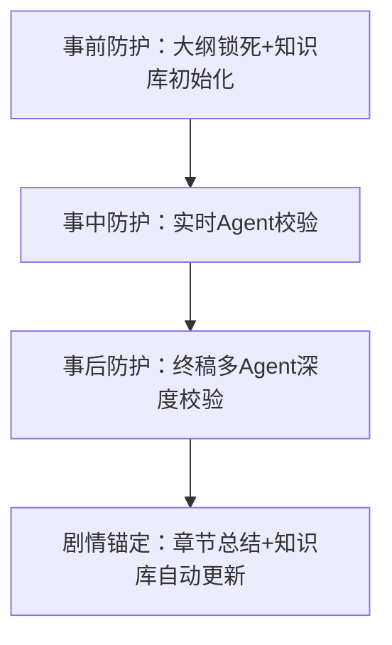

# 网文写手全生命周期工业化AI创作平台

## 产品功能与逻辑说明书

**版本**：V1.1

**编制日期**：2026-03-24

**适用范围**：产品设计、研发、运营全团队

---

## 一、项目核心定位

- **核心定位**：为普通网文写手打造的**全生命周期工业化AI创作基础设施**，区别于通用AI写作工具/平台自有AI，以「设定一致性为核心」，用多Agent集群+动态知识库，给写手配置专属网文工作室级创作能力

- **核心解决痛点**：长篇写崩、AI过审难、创作效率低三大生存级痛点

- **核心差异化**：

    1. 以「防幻觉/防崩」为核心，而非「生成为核心」，全流程锁死设定边界

    2. 多模型异构Agent集群，弥补单模型系统性盲区，极致降幻觉

    3. 覆盖从创意→完本→过审的全链路，而非单一环节工具

    4. 中立第三方，不绑定单一平台，全平台适配赋能

---

## 二、全量功能点梳理（按模块+开发优先级）

### 2.1 基础支撑层（底层能力，MVP必做）

|功能模块|核心功能点|开发优先级|作用说明|
|---|---|---|---|
|用户与作品管理|账号注册/登录、多作品管理、作品信息配置（赛道/目标平台/字数）、版本回溯、数据导出|✅MVP|为全平台功能提供用户身份与作品上下文，支持多项目并行创作|
|多模型统一路由|兼容OpenAI格式统一调用（GPT-5.4/Gemini 3.1 Pro/Claude Opus 4.6/DeepSeek V3.2）、模型负载均衡、超时重试、Token统计|✅MVP|屏蔽多模型API差异，为多Agent集群提供统一调用入口|
|基础创作编辑器|类Word富文本编辑、Markdown支持、章节草稿保存、实时字数统计|✅MVP|为写手提供核心创作入口|
---

### 2.2 核心防崩体系（项目根基，MVP核心）

|功能模块|核心功能点|开发优先级|作用说明|
|---|---|---|---|
|动态知识库（实时更新）|人物库（全维度设定/关系图谱/人设弧光）、伏笔库（埋入/回收追踪）、物品库（归属/位置全链路追踪）、世界观库（规则/负面禁令）、时间线地图库（防瞬移/时间混乱）|✅MVP|全维度锁死设定边界，从根源杜绝人设/逻辑/伏笔崩坏|
|三级大纲锁死体系|一级大纲（全本主线，不可修改）、二级大纲（分卷单元，可编辑）、三级大纲（单章细纲，3-5核心节点）、大纲可视化树、拖拽调整|✅MVP|从源头锁死剧情边界，杜绝AI放飞自我|
|章节总结与剧情锚定|单章100-300字结构化总结自动生成、核心进展/人物变化/伏笔更新提取、知识库更新建议、历史总结检索|✅MVP|压缩上下文，为AI提供清晰剧情时间线，避免长上下文注意力衰减|
|知识库自动更新|AI自动提取章节信息更新知识库、人工审核确认、版本回溯|✅MVP|降低写手维护成本，保证设定实时同步|
---

### 2.3 多Agent智能协同体系（差异化壁垒，V1.0核心）

|Agent角色|核心功能|绑定模型|开发优先级|
|---|---|---|---|
|设定守护Agent（最高优先级）|全流程人设/世界观/伏笔/逻辑校验、防OOC/防幻觉/防规则违反|GPT-5.4 + Gemini 3.1 Pro（双模型并行校验）|✅MVP|
|逻辑杠精Agent|极限挑刺、逻辑漏洞排查、剧情推演、大纲压力测试|Claude Opus 4.6|⭐V1.0|
|商业化专家Agent|网文节奏/爽点/钩子优化、连载感打磨|DeepSeek V3.2|⭐V1.0|
|文风守护Agent|风格仿写校验、个人文风贴合、风格一致性管控|Gemini 3.1 Pro / Claude Opus 4.6|⭐V1.0|
|剧情锚定Agent|章节总结生成、知识库自动更新、剧情时间线维护|GPT-5.4|⭐V1.0|
|终局仲裁Agent|多Agent辩论仲裁、统一输出方案、终止辩论|GPT-5.4（唯一指定）|⭐V1.0|

#### 核心Agent工作流（V1.0必做）

- 大纲压力测试工作流：初始大纲→正反方Agent辩论→漏洞排查→优化方案→锁死大纲+初始知识库

- 实时创作校验工作流：章节片段→双模型Guardian校验→共识投票→分歧辩论→修正方案

- 终稿深度校验工作流：章节初稿→多Agent并行校验→交叉辩论→共识达成→章节总结+知识库更新→终稿输出

- 风格仿写工作流：上传文本→风格解析→风格特征卡→生成校验→应用风格

---

### 2.4 风格仿写与文风守护体系（V1.0核心）

|功能模块|核心功能点|开发优先级|作用说明|
|---|---|---|---|
|风格配置体系|6维度风格配置（文风/叙事视角/节奏/对话比例/张力/感官密度）、预设风格模板|✅MVP|满足基础风格控制需求|
|文风全流程管控|风格配置绑定、AI生成全程风格校验、风格库管理|⭐V1.0|保证全文字风统一，解决AI续写风格割裂问题|

---

### 2.5 平台过审与AI消痕体系（V1.0核心）

|功能模块|核心功能点|开发优先级|作用说明|
|---|---|---|---|
|AI味检测|多维度AI痕迹检测（词汇多样性/句长波动/套话密度）、AI味评分、阈值预警|✅MVP|检测AI生成内容的典型特征，给出量化指标|
|统计特征优化|词汇多样性增强、句长波动优化、套话密度控制|A待规划|让AI文本无限接近人类写作分布|

---

### 2.6 运营数据看板（V1.0配套）

|功能模块|核心功能点|开发优先级|作用说明|
|---|---|---|---|
|创作进度追踪|总字数/日均字数/本周完成率、章节完成进度条、预计完本时间|⭐V1.0|让写手清晰掌握创作节奏|
|质量趋势分析|AI味趋势图、一致性评分趋势、章节评分分布|⭐V1.0|量化内容质量变化，指导优化方向|
|知识库健康度|人物出场频率、伏笔埋设/回收统计、世界观冲突预警|⭐V1.0|监控设定一致性，发现潜在崩坏风险|
|创作效率统计|章节生成耗时/修改次数/版本回滚统计、单章平均创作时长|⭐V1.0|分析创作效率瓶颈，优化工作流|
|工作流分析|Agent校验通过率、修订轮次分布、典型问题类型排行|⭐V1.0|了解系统辅助效果，指导后续迭代|

---

## 三、内在逻辑全链路梳理

### 3.1 核心业务逻辑闭环（从创意到完本的全链路）

核心业务逻辑闭环遵循"从创意输入到完本交付、再到数据沉淀迭代"的全链路，具体流程如下：

首先由用户输入核心创意，随后通过三级大纲锁死全本主线与分卷、单章节点，实现事前防崩，避免剧情偏离；接着初始化动态知识库，完善人物、伏笔、世界观等核心设定，为后续创作提供统一标准；之后通过多Agent对初始大纲进行压力测试，排查逻辑漏洞并优化，最终锁死大纲与初始知识库；进入章节创作阶段后，实时通过Agent校验内容，避免人设、逻辑崩坏，实现事中防崩；章节初稿完成后，由多Agent并行深度校验、交叉辩论，达成共识后生成终稿，同时自动生成章节总结，更新动态知识库，完成事后防崩与数据沉淀；终稿经过AI味检测和优化，适配各平台检测规则；最后通过章节总结持续更新知识库，形成"创作越多→数据越多→Agent越精准→体验越好"的数据飞轮，实现业务闭环迭代。

- **核心逻辑**：以「设定一致性」为核心，全流程管控AI创作，从源头扼杀幻觉，解决写手从创作到完本的核心痛点

- **底层逻辑**：将头部网文工作室的工业化创作流程，拆解为AI可执行的标准化模块，零门槛开放给普通写手

---

### 3.2 技术架构逻辑（分层解耦，高可扩展）

技术架构采用分层解耦模式，整体分为六层，各层自上而下依次衔接、独立可扩展，具体层级及功能如下：

- **前端层**：React开发，极简黑盒化，隐藏所有技术细节，为写手提供一键式操作的功能入口

- **API网关层**：基于FastAPI搭建，负责统一接口管理、权限管控以及请求路由

- **业务逻辑层**：核心业务实现载体，负责落地知识库管理、大纲管控、章节创作等所有核心业务规则

- **Agent编排层**：通过LangGraph实现多Agent的工作流调度、辩论机制管控以及优先级排序

- **多模型路由层**：屏蔽不同外部大模型（GPT-5.4、Gemini 3.1 Pro、Claude Opus 4.6、DeepSeek V3.2）的API差异，统一采用OpenAI格式调用

- **数据层**：PostgreSQL关系库存储结构化数据，ChromaDB向量库支撑语义检索，Redis缓存提升系统响应速度

---

### 3.3 多Agent协同逻辑（极致降幻觉，弥补单模型盲区）

#### 3.3.1 主从架构+优先级锁死

|优先级|Agent角色|核心规则|
|---|---|---|
|1（最高）|设定守护Agent|所有修改必须先通过校验，绝对禁止突破设定边界|
|2|逻辑杠精Agent/商业化专家Agent|围绕设定边界，分别负责漏洞排查与节奏优化|
|3|文风守护Agent/剧情锚定Agent|负责风格、知识库更新，不得修改核心设定|
|0（兜底）|终局仲裁Agent|解决Agent分歧，统一输出方案，终止辩论|

#### 3.3.2 多模型异构冗余机制

- 核心校验Agent（设定守护）采用**双模型并行+共识投票**，分歧触发第三方（逻辑杠精）辩论

- 每个Agent绑定最擅长的模型：Gemini负责风格、DeepSeek负责网文、Claude负责挑刺、GPT负责仲裁

#### 3.3.3 收敛式辩论机制

- 所有辩论严格围绕「用户设定+三级大纲+动态知识库」展开，禁止修改用户核心创意

- 明确终止条件：达成共识/最多5轮辩论，由终局仲裁Agent输出最终可执行方案

---

### 3.4 防幻觉核心逻辑（三层防护，全链路扼杀）

- **事前防护**：用三级大纲锁死剧情边界，用动态知识库锁死设定边界

- **事中防护**：每写一段，设定守护Agent实时校验，发现冲突立刻预警修正

- **事后防护**：多Agent交叉辩论，全维度核查人设/逻辑/伏笔/规则

- **剧情锚定**：用章节总结压缩上下文，自动更新知识库，保证设定实时同步

---

## 四、功能迭代路径（MVP→V1）

|阶段|核心功能|上线时间|核心目标|
|---|---|---|---|
|MVP（最小可行产品）|用户管理、基础知识库、三级大纲、基础编辑器、单Agent实时校验、多模型基础路由|1个月|跑通核心防崩逻辑，验证产品核心价值|
|V1.0（核心功能完整）|多Agent全工作流、章节总结自动更新、风格配置体系、AI味检测、数据看板|2-3个月|实现全链路防崩+AI味控制，数据驱动优化|

---

## 五、核心约束与红线（必须严格执行）

### 5.1 合规红线

- 用户上传内容版权责任由用户自行承担，平台仅提供工具服务

- 全流程合规校验：内置违禁词/违规内容检测，避免平台违规风险

### 5.2 优先级红线

- 所有Agent修改必须遵循：**设定守护>风格贴合>节奏优化>文笔润色**，绝对禁止为优化其他维度突破设定边界

- 一级大纲一旦确认，永久不可修改，仅允许二级/三级大纲调整

### 5.3 技术约束

- 所有模型统一采用OpenAI兼容格式调用，屏蔽原生API差异

- 多Agent辩论必须设置明确终止条件，禁止无限循环

- 知识库版本回溯机制，支持错误回滚，避免不可逆数据损坏

---

## 六、附录：模型API适配说明

|模型|原生端点|OpenAI兼容端点|调用方式|
|---|---|---|---|
|Gemini 3.1 Pro Preview|`/v1beta/models/gemini-3.1-pro-preview:generateContent`|`/v1/chat/completions`|统一OpenAI格式调用|
|Claude Opus 4.6|`/v1/messages`|`/v1/chat/completions`|统一OpenAI格式调用|
|DeepSeek V3.2|-|`/v1/chat/completions`|统一OpenAI格式调用|
|GPT-5.4|原生OpenAI格式|`/v1/chat/completions`|原生调用|

> （注：文档部分内容可能由 AI 生成）