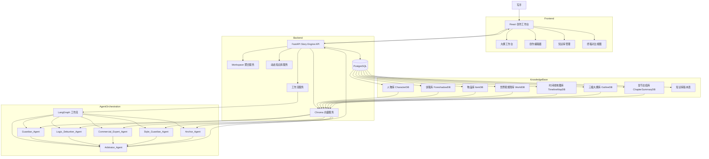

# 网文创作中台重写架构

## 系统架构图



## 重写版目录结构

```text
novels/
├── backend/
│   ├── agents/
│   │   └── story_agents.py              # 六类核心 Agent 定义、Prompt 模板与输出协议
│   ├── api/
│   │   └── v1/
│   │       └── story_engine.py          # 动态知识库 CRUD、工作流触发、工作台聚合接口
│   ├── db/
│   │   └── migrations/
│   │       └── versions/
│   │           └── 20260323_0017_story_engine_rewrite.py
│   ├── models/
│   │   └── story_engine.py              # 人物/伏笔/物品/世界规则/时间线/大纲/章节总结/版本表
│   ├── schemas/
│   │   └── story_engine.py              # API 输入输出 Schema
│   ├── services/
│   │   ├── chroma_service.py            # Chroma 向量索引与语义检索
│   │   ├── story_engine_kb_service.py   # 知识库 CRUD、版本回溯、守护校验
│   │   └── story_engine_workflow_service.py
│   │                                       # LangGraph 三条核心工作流
│   └── requirements.txt
├── frontend/
│   ├── app/
│   │   └── dashboard/
│   │       └── projects/
│   │           └── [projectId]/
│   │               └── story-room/
│   │                   └── page.tsx     # 写手唯一主工作台
│   ├── components/
│   │   └── story-engine/
│   │       ├── outline-workbench.tsx    # 大纲压力测试工作台
│   │       ├── draft-studio.tsx         # 极简编辑器 + 实时设定守护
│   │       ├── knowledge-base-board.tsx # 知识库管理
│   │       └── final-diff-viewer.tsx    # 终稿对比视图
│   └── types/
│       └── api.ts
├── docs/
│   └── architecture/
│       └── story-engine-rewrite.md
├── docker-compose.yml
└── README.md
```

## 重写原则

1. 产品只保留一条写作主路径：大纲压测 -> 正文生成/续写 -> 多轮优化 -> 设定圣经沉淀 -> 100-300 字章节总结。
2. 旧项目的认证、项目容器、基础 Docker 能保留，但新小说系统逻辑不再依赖旧 Story Bible 流水线。
3. 新知识库统一由 PostgreSQL 负责结构化真相源，由 Chroma 负责语义召回。
4. 三级大纲中一级大纲默认锁死，不允许通过普通 CRUD 修改。
5. 所有知识库写入都自动生成版本快照，支持按实体回滚。
6. 前端不暴露 Agent、辩论、向量检索等术语，统一翻译成写手可理解的按钮与结果。
